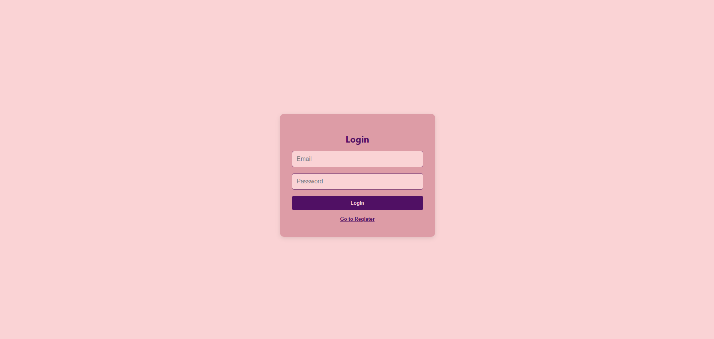
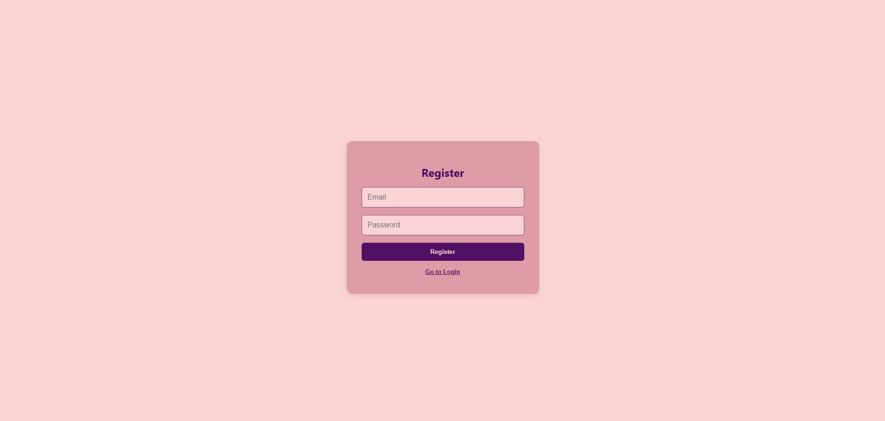

# Full Stack Chat App (React + Node.js + Socket.IO)

A real-time chat application built with React (TypeScript), Node.js (Express), and Socket.IO.
Users can register, log in, and send messages in direct or group chats with real-time updates.

---

## Screenshots

### Login Page

### Register Page

### Chat Page

---

## Features

- User registration (username, email, password)
- JWT login authentication
- Role-based access (Admin / User)
- Direct messaging and group chats
- Real-time messaging with Socket.IO
- Dynamic chat lists
- Clean and minimal UI

---

## Getting Started

### Prerequisites

- Node.js + npm
- MongoDB or PostgreSQL database (local or hosted)

---

### Backend Setup

# 1. Install dependencies

npm install

# 2. Create a .env file in backend/

PORT=5000
JWT_SECRET=your_secret
DB_URI=your_database_uri

# 3. Start the backend server

npm run dev

### Frontend Setup

# 1. Navigate to the frontend folder

cd frontend

# 2. Install dependencies

npm install

# 3. Start the development server

npm start
